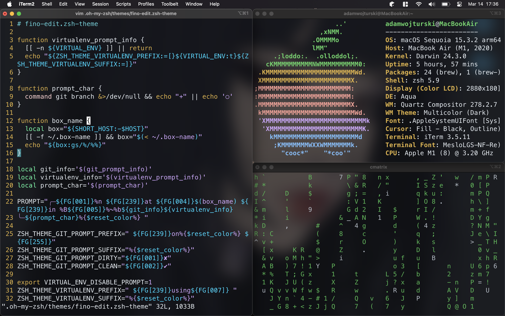

# My Dotfiles

<div align="center">
  
</div>

## Contents

- ZSH configuration
- Oh My ZSH customizations
- iTerm2 preferences
- Vim configuration

## Installation

1. Clone this repo to `~/dotfiles`
2. Run setup script:
```bash
chmod +x bootstrap.sh
./bootstrap.sh